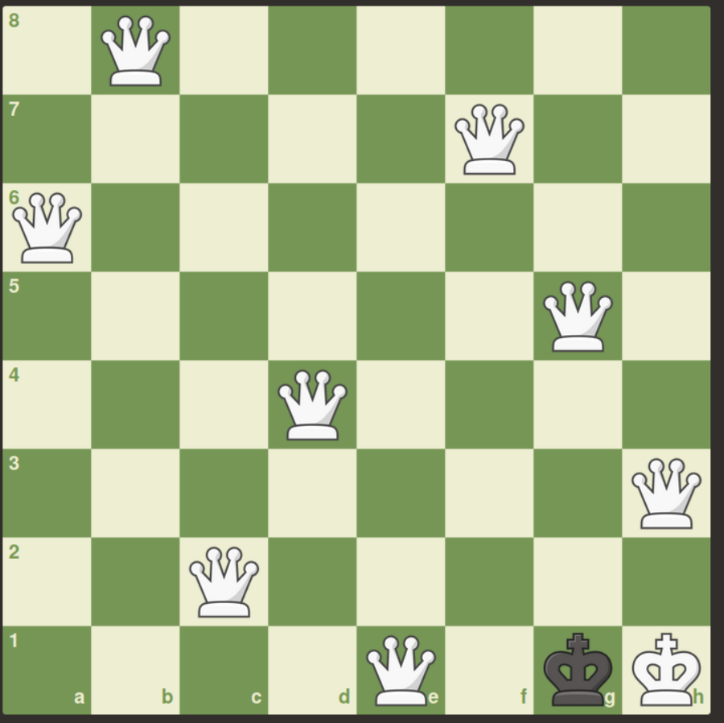

# 8QueenGA
A genetic algorithm approach for solving eight queen problem.

## Encoding (Chromosome representation)
The phenotypes are encoded with a vector of size eight.
Element i-th of this vector shows the row at which the queen
in the i-th column is placed.

Encoding is implemented in `Entity` class.

## Genetic operators
Until now, only the cross over operation is implemented.

Mutation operator is to be implemented in future.

## A result

